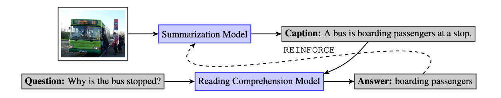

# CapWAP - CapWAP: Captioning with a Purpose

Adam Fisch (MIT - Work done at Google), Kenton Lee (Google), Ming-Wei Chang (Google), Jonathan Clark (Google), and Regina Barzilay (MIT).

## Abstract



Summarization systems need to perform *content selection* to decide how to structure the output text. Like large documents, images also have rich content that must be boiled down via some selection process. Traditional approaches for image summarization use reference captions as the main source of indirect supervision for this task.  This project instead explores the task of using question-answer pairs generated by users as weak supervision, where we assume that these questions reflect the true information-need of the user. Instead of learning to match outputs to some (arbitrarily picked) reference, the quality of a caption is measured using the caption's ability to serve as informative context for a reading comprehension model faced with a selection of the user questions.

The resulting training framework, `CapWAP`,  is based on model-in-the-loop reinforcement learning, where a BERT Large reading comprehension model training on SQuAD 2.0 gives the rewards to the captioning policy.

## Installation

`CapWAP` should be compatible with Python 2 or 3 (tested with 3), and a Unix-like system. It requires Tensorflow v1.14+.

If you haven't already done so, setup the parent Google AI Language [repository](https://github.com/google-research/language):

```bash
git clone https://github.com/google-research/language
python setup.py develop
```

Training relies on the [compare_gan](https://github.com/google/compare_gan) library. Follow the [instructions](https://github.com/google/compare_gan#installation) there for installing.


Additionally:

```
pip install tensor2tensor
pip install bert-tensorflow
```

## Data Download

To download all of the datasets used in the paper, run:

```bash
./download.sh
```

Note: this requires [gsutil](https://cloud.google.com/storage/docs/gsutil).

By default this will create and download to a `data` subfolder in the current directory. To change this, either supply a different directory via the command line:

```bash
./download.sh /my/data/path
```

or set the `CAPWAP_DATA` environment variable:

```bash
export CAPWAP_DATA=/my/data/path
```

If you choose to use the command line option, you should set the `CAPWAP_DATA` environment variable afterwards to point to the same place.

*Important: For the commands in the instructions below, it is assumed that the environment variable is set!*

## Instructions

Note that, end-to-end, all the following steps take a fair amount of time and compute. All of our original experiments were run on TPUs (`2x2` or `4x4`). We provide [pre-trained models](#pre-trained-models) that you can use (and thereby skip most of these steps).

All of the training scripts (`training/train_supervised.py`, `training/train_reinforce.py`) take two modes: `train` and `evaluate`. For every experiment, two simultaneous jobs are intended to be run separately: one for training and saving checkpoints, the other for validating and saving the best ones. In the following instructions, `model.ckpt-best` refers to the checkpoint that has the best validation result (which is automatically saved by the second validation job, if you run it).

### Model Directory

All training scripts accept a `--model_dir` argument to select where your model files will be saved.

If the `--model_dir` argument is not given, models will be saved to a temporary directory (`/tmp/${USER}/capwap/adhoc_models/<uid>`).

To change the default temporary directory (`/tmp`), set the `--tempdir` argument (all training scripts accept it) or the `CAPWAP_TMP` environment variable.

*Important: For the following commands, we assume that you have set the `MODEL_DIR` environment variable, e.g. `export MODEL_DIR=/tmp/${USER}/capwap/models`.*

### Visual QA Data

Preprocess the visual QA datasets.

```bash
python preprocessing/vqa_qa.py
python preprocessing/gqa_qa.py
python preprocessing/v7w_qa.py
python preprocessing/vizwiz_qa.py
```

### Out-of-Domain Supervised Pre-Training

Preprocess the Microsoft COCO data:

```bash
python preprocessing/coco_ood_captions.py
```

Run training:

```bash
python training/train_supervised.py \
    --mode=train \
    --ood_caption_weight=1.0 \
    --ood_caption_train_pattern="data/COCO/processed/captions/train-*" \
    --ood_caption_eval_pattern="data/COCO/processed/captions/val-*" \
    --model_dir=${MODEL_DIR}/COCO
```

*Important: In order to validate checkpoints with the `CIDEr` metric (when running with `--mode=evaluate`), you need to download the [COCO caption tools](https://github.com/tylin/coco-caption) and interface with them in [metric_utils.py](utils/metrics.py) (see the reference metrics section).*

### Weakly-Supervised Pre-Training

This has three main steps (see Algorithm 1 in the paper for details):

1. **LEARN**: Learn a "text planner" that generates off-policy, high-quality captions by conditioning on the question and answer being asked.
2. **GENERATE**: Use the text planner to generate synthetic captions for the target datasets.
3. **ADAPT**: Adapt the [out-of-domain captioning model](#out-of-domain-supervised-pre-training) using the synthetic captions as weak supervision.

#### LEARN

Preprocess the COCO captions for question generation:

```bash
python preprocessing/coco_synthetic_qa.py
```

Generate questions for COCO. It is recommended to use a job scheduler for this part. For each data shard run the following sequentially:

```bash
# Example for shard 00000 out of 00256.
export SHARD=00000
export NUM_SHARDS=00256

python synthetic/generate_answers.py \
    --predict_precomputed_file=${CAPWAP_DATA}/processed/qgen/contexts/train-${SHARD}-of-${NUM_SHARDS} \
    --output_dir=${CAPWAP_DATA}/processed/qgen/answers/train-${SHARD}-of-${NUM_SHARDS}

python synthetic/generate_questions.py \
    --predict_precomputed_file=${CAPWAP_DATA}/processed/qgen/answers/train-${SHARD}-of-${NUM_SHARDS}/predicted-tfrecords \
    --output_dir=${CAPWAP_DATA}/processed/qgen/questions/train-${SHARD}-of-${NUM_SHARDS}

python synthetic/filter_round_trip.py \
    --input_file=${CAPWAP_DATA}/processed/qgen/questions/train-${SHARD}-of-${NUM_SHARDS}/predicted-tfrecords \
    --output_file=${CAPWAP_DATA}/processed/qgen/consistent/train-${SHARD}-of-${NUM_SHARDS}/predicted-tfrecords
```

Preprocess the generated COCO questions:

```bash
python preprocessing/coco_text_planner.py \
    --split=train \
    --sqa_path=${CAPWAP_DATA}/COCO/processed/qgen/consistent \
    --output_dir=${CAPWAP_DATA}/COCO/processed/qgen/planner_input
```

***

**Wikipedia augmentation:** (Optional) To augment the data with Wikipedia text, similarly run `preprocessing/text_synthetic_qa.py` to preprocess the text data, and then process the individual shards as below. Note that `preprocessing/text_synthetic_qa.py` uses Apache Beam; you will need to implement the `main()` in order to run the pipeline according to your individual setup.

*Note: No need to do any further preprocessing after this step for the Wikipedia text, just point to that output directory in the next steps.*

***

Finally, train the text planner:

```bash
python training/train_supervised.py \
    --num_train_steps=200000 \
    --mode=train \
    --conditional_decoding=true \
    --metric=f1_score \
    --target_vqa_eval_pattern="${CAPWAP_DATA}/${DATASET}/processed/questions/val-*" \
    --target_question_eval_file=${CAPWAP_DATA}/${DATASET}/processed/questions/val.json \
    --ood_caption_weight=1.0 \
    --ood_caption_train_pattern="${CAPWAP_DATA}/COCO/processed/captions/train-*" \
    --ood_caption_eval_pattern="${CAPWAP_DATA}/COCO/processed/captions/val-*" \
    --wsp_caption_weight=1.0 \
    --wsp_caption_train_pattern="${CAPWAP_DATA}/COCO/processed/qgen/planner_input/train-*" \
    --wsp_text_weight=1.0 \
    --wsp_text_train_pattern="${CAPWAP_DATA}/WIKI/processed/qgen/consistent/*" \
    --model_dir=${MODEL_DIR}/planner
```

Here the different file patterns correspond to the following inputs:

  * `ood_caption_*`: Adds `(x, null, a, y)` tuples where `(x, y)` are true out-of-domain image-caption pairs and `a` is a randomly sampled subspan of `y`.
  * `wsp_caption_*`: Adds `(x, q, a, y)` tuples where `(x, y)` are true out-of-domain image-caption pairs and `(q, a)` are synthetically generated from `y`.
  * `wsp_text_*`: Adds `(null, q, a, y)` tuples where `y` is a generic sentence (from Wikipedia) and `(q, a)` are synthetically generated from `y`. The questions tend to be a bit higher quality (as the question generation model was trained on SQuAD, which is from Wikipedia).

*Note: We choose to validate on VQA (`target_vqa_eval_pattern`, ...).*

#### GENERATE

Run the text planner on a target dataset while computing rewards R(y|q, a). This example is for VQA:

```bash
python evaluation/infer_wsp_captions.py \
    --checkpoint=${MODEL_DIR}/planner/model.ckpt-best \
    --input_pattern="${CAPWAP_DATA}/VQA/processed/questions/train-*" \
    --output_file=${CAPWAP_DATA}/VQA/processed/synthetic/train_generated.json \
    --num_rollouts=16
```

Preprocess the generated weakly-supervised pairs (again, moved back to local disk). Filter on exact matches.

```bash
python preprocessing/weakly_supervised.py \
    --features=${CAPWAP_DATA}/COCO/train_features.hdf5 \
    --generation_file=${CAPWAP_DATA}/VQA/processed/synthetic/train_generated.json \
    --output_dir=${CAPWAP_DATA}/VQA/processed/synthetic \
    --reward=exact_match \
    --threshold=1.0
```

#### ADAPT

Adapt the captioning model via MLE fine-tuning. This example is for VQA:

```bash
python training/train_supervised.py \
    --mode=train \
    --metric=f1_score \
    --target_vqa_eval_pattern="${CAPWAP_DATA}/VQA/processed/questions/val-*" \
    --target_question_eval_file=${CAPWAP_DATA}/VQA/processed/questions/val.json \
    --ood_caption_weight=0.3 \
    --ood_caption_train_pattern="${CAPWAP_DATA}/COCO/processed/captions/train-*" \
    --wsp_caption_weight=0.7 \
    --wsp_caption_train_pattern="${CAPWAP_DATA}/VQA/processed/synthetic/train-*" \
    --model_dir=${MODEL_DIR}/VQA/wsp \
    --warm_start_path=${MODEL_DIR}/COCO/model.ckpt-50000
```

### Reinforcement Learning

Train the captioning policy using REINFORCE. This example is for VQA:

```bash
python training/train_reinforce.py \
    --mode=train \
    --metric=f1_score \
    --reward=f1_score \
    --target_vqa_weight=0.5 \
    --target_vqa_train_pattern="${CAPWAP_DATA}/VQA/processed/questions/train-*" \
    --target_vqa_eval_pattern="${CAPWAP_DATA}/VQA/processed/questions/val-*" \
    --target_question_eval_file=${CAPWAP_DATA}/VQA/processed/questions/val.json \
    --ood_caption_weight=0.25 \
    --ood_caption_train_pattern="${CAPWAP_DATA}/COCO/processed/captions/train-*" \
    --wsp_caption_weight=0.25 \
    --wsp_caption_train_pattern="${CAPWAP_DATA}/VQA/processed/synthetic/train-*" \
    --base_model=${MODEL_DIR}/VQA/wsp/model.ckpt-best \
    --model_dir=${MODEL_DIR}/VQA/rl_wsp
```

### Evaluation

Evaluate the QA performance of a trained model:

```bash
# Step 1: Generate captions.
export DATASET=VQA
export SPLIT=val
export CKPT=${MODEL_DIR}/${DATASET}/rl_wsp/model.ckpt-best
python evaluation/infer_captions.py \
    --checkpoint=${CKPT} \
    --input_pattern="${CAPWAP_DATA}/${DATASET}/processed/questions/${SPLIT}-*" \
    --output_file=${CKPT}.${DATASET}.caption

# Step 2: Score captions.
python evaluation/score_captions.py \
    --caption_file=${CKPT}.${DATASET}.caption \
    --question_file="${CAPWAP_DATA}/${DATASET}/processed/questions/${SPLIT}.json" \
    --output_file=${CKPT}.${DATASET}.eval
```

### Pre-trained Models

You can download all the pre-trained captioning models here:

```bash
gsutil cp gs://capwap/models.zip .
unzip models.zip && rm models.zip
```

The unzipped directory will look like:

```.
├── COCO
├── GQA
│   ├── rl
│   ├── rl_wsp
│   └── wsp
├── V7W
│   ├── rl
│   ├── rl_wsp
│   └── wsp
├── VIZWIZ
│   ├── rl
│   ├── rl_wsp
│   └── wsp
└── VQA
    ├── rl
    ├── rl_wsp
    └── wsp
```

The model files are in each subdirectory (`model.ckpt-best`).

### Deriving Image Features

We use the "Bottom-Up" R-CNN features from [Anderson et. al., 2018](http://openaccess.thecvf.com/content_cvpr_2018/CameraReady/1163.pdf). See the README in that [GitHub repo](https://github.com/peteanderson80/bottom-up-attention) for instructions on how to generate features for raw images (see [generate_tsv.py](https://github.com/peteanderson80/bottom-up-attention/blob/master/tools/generate_tsv.py)). It requires installing Cafe.

After the features have been generated, we transfer them from TSV format to an HDF5 file. An example script for this is in [utils/tsv_to_hdf5.py](utils/tsv_to_hdf5.py).

## Limitations and Extensions

This new paradigm for learning information-specific summarization policies is difficult. Though `CapWAP` takes first steps towards alieviating some of the challenges (e.g., reward sparsity), this style of image summarization still has several limitations and areas of future research. Important extensions could include:

  * Improving the image input features (e.g., to include more OCR/scene recognition attributes);
  * Incorporationg language-model-based rewards for better fluency;
  * Larger sources of weakly-supervised and/or out-of-domain pretraining data;
  * And more.

## Citation

If you use this in your work please cite:

```
@inproceedings{fisch2020capwap,
  title={CapWAP: Captioning with a Purpose},
  author={Adam Fisch and Kenton Lee and Ming-Wei Chang and Jonathan Clark and Regina Barzilay},
  booktitle={Proceedings of the 2020 Conference on Empirical Methods in Natural Language Processing},
  year={2020},
}
```
