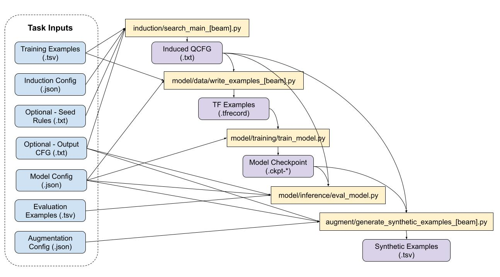

# Compositional Structure Learner (CSL)

This directory contains code for the paper ["Improving Compositional Generalization with Latent Structure and Data Augmentation"](https://arxiv.org/abs/2112.07610)
(Linlu Qiu, Peter Shaw, Panupong Pasupat, Paweł Krzysztof Nowak, Tal Linzen, Fei Sha, Kristina Toutanova)


## Synthetic Data Generation Pipeline

Below is a diagram describing the various components involved to generate
synthetic data.




The yellow boxes show the path of Python files relative to this directory.
The purple boxes are generated artifacts.

The input files consist of:

* Training and evaluation examples, in `.tsv` format with one line per example encoded as
`<input>\t<output>\n`.
* Three `.json` configuration files, one for each stage of the pipeline.
* An optional `.txt` file with seed rules for grammar induction.
* An optional `.txt` file with a Context-Free Grammar (CFG) defining valid outputs for the given task.

Examples of these input files are referenced below for each task studied in the
paper.

Note that in order for grammar induction to be
effective, it can be necessary for outputs to be encoded
as strings in a way that enables a decomposition within the QCFG formalism, e.g.
enables identifying corresponding sub-spans between inputs and outputs
effectively. It can also be helpful to determine a set of seed rules and a CFG
that constrains valid outputs. For most tasks, seed rules and the output CFG are
generated from the training data using various heuristics, as a preprocessing
step.

Once synthetic training examples are generated,
you can
combine the original and synthetic examples using the script
`augment/merge_tsvs.py`. These examples can be used to train
any downstream model. To reproduce the results in the paper, you can follow
these instructions below for fine-tuning and inference with T5 models:

https://github.com/google-research/language/blob/master/language/compgen/nqg/README.md#t5

## Setup and Prerequisites

All python scripts should be run using Python 3 while in the top-level of this
repository using `-m`. For example:

```shell
python -m language.compgen.csl.induction.search_main
```

Widely used prerequisite modules are `absl-py` and `tensorflow`.

We provide two versions of various modules, one that can be used with Apache
Beam for efficient parallel processing of larger datasets, and one that does not
have this dependency.

## Tasks

### SCAN

You can find the instructions for downloading and preprocessing the SCAN splits here:

https://github.com/google-research/language/blob/master/language/compgen/nqg/README.md#scan

The necessary configuration files for SCAN are located under `tasks/scan`. SCAN
does not use any seed rules or an output CFG.

### GeoQuery

You can find instructions for GeoQuery preprocessing here:

https://github.com/google-research/language/blob/master/language/compgen/nqg/README.md#geoquery

Additionally, the example IDs for the new TMCD and Template splits are located
in the `tasks/geoquery/splits` directory.

The configuration files and an output CFG for GeoQuery is located under
`tasks/geoquery`. The seed rules are generated using the script
`tasks/generate_exact_match_rules.py`.

### COGS

The relevant files for COGS are located in the `tasks/cogs`
directory. This includes the script `tasks/tools/preprocess_cogs_data.py` which
converts COGS examples to the variable-free intermediate representation we use.
Also included are the seed rules which were generated using an IBM alignment
model run on the training data, and the corresponding output CFG.

The dataset can be downloaded from: https://github.com/najoungkim/COGS

### SMCalFlow-CS

The configuration files for SMCalFlow-CS are included under `tasks/smcalflow`.
We re-tokenize inputs using `smcalflow/tools/retokenize_inputs.py`.
Additionally, there is a tool for heuristically filtering the training data
to discard some noisy examples `smcalflow/tools/filter_examples.py`. Also,
there are tools to generate seed rules and an output CFG from the training data,
`smcalflow/tools/generate_identity_rules.py` and
`smcalflow/tools/generate_target_cfg.py`. The generated seed rules are used
along with the manually specified seed rules, `smcalflow/manual_seed_rules.txt`.

There are also additional utilities for preprocessing the data for T5.

The dataset can be downloaded from: https://github.com/microsoft/compositional-generalization-span-level-attention#download-dataset
