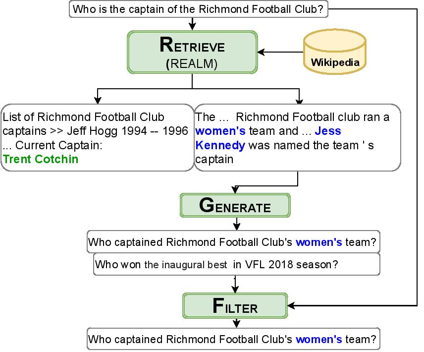

# RGF: Retrieval-guided Counterfactual Generation for QA

This page contains code and documentation for the paper [Retrieval-guided Counterfactual Generation for QA](https://arxiv.org/abs/2110.07596) by Bhargavi Paranjape, Matthew Lamm, and Ian Tenney, to be presented at ACL 2022.

To cite this work, please use the following BibTeX:

```
@article{paranjape2021retrieval,
  title={Retrieval-guided Counterfactual Generation for QA},
  author={Paranjape, Bhargavi and Lamm, Matthew and Tenney, Ian},
  journal={arXiv preprint arXiv:2110.07596},
  year={2021}
}
```

## Overview of RGF

RGF is a general framework to generate counterfactual examples for question answering (QA), applicable to both the reading comprehension and open-domain settings. Counterfactual examples are alternative inputs designed to simulate interventions on specific attributes. For QA, the set of possible features to perturb is difficult to enumerate _a priori_, as relevant factors are often instance-specific and exploring them may require world knowledge; moreover, reasonable edits can easily result in false premises or unanswerable questions.

We introduce the (**R**)etrieve, (**G**)enerate, and (**F**)ilter (RGF) method, which uses near-misses of a retrieve-and-read QA model (such as [Guu et al. 2020](https://github.com/google-research/language/tree/master/language/realm)) to propose alternate contexts and answers which are closely related to — but semantically distinct from — the original question. We then use a sequence-to-sequence question generation model ([Alberti et al., 2019](https://arxiv.org/abs/1906.05416)) to generate corresponding questions to these passages and answers. This results in fully-labeled examples, which can be used directly to augment training data or filtered post-hoc for analysis.

**R**etrieve-**G**enerate-**F**ilter framework consists of three steps:

1. **Retrieve** - We use a retrieve-the-read model ([REALM](https://github.com/google-research/language/tree/master/language/realm)) to generate candidate (answer, context) tuples.
2. **Generate** - a seq2seq question-generation model generates candidate questions _q'_.
3. **Filter** - we use an edit-distance heuristic to filter large-scale training data, and employ a question-decomposition model based on [QED](https://arxiv.org/abs/2009.06354) for more detailed evaluation.

An example of the pipeline is shown below:




## Codebase overview

_Coming soon!_

## Contact

Please make use of github issues to ask questions/hold discussion.
